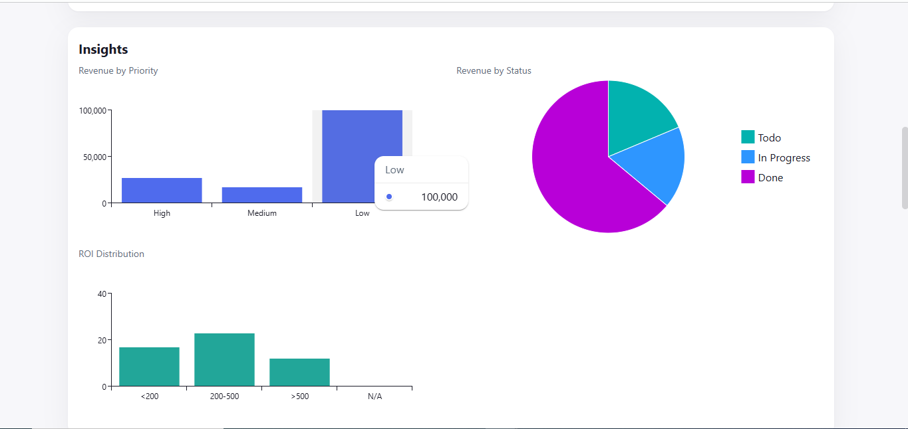
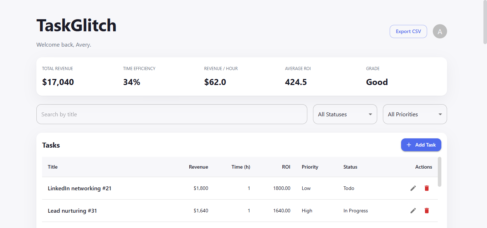
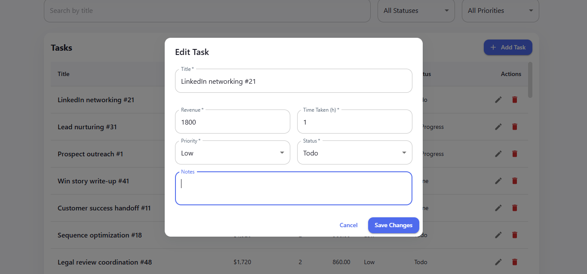
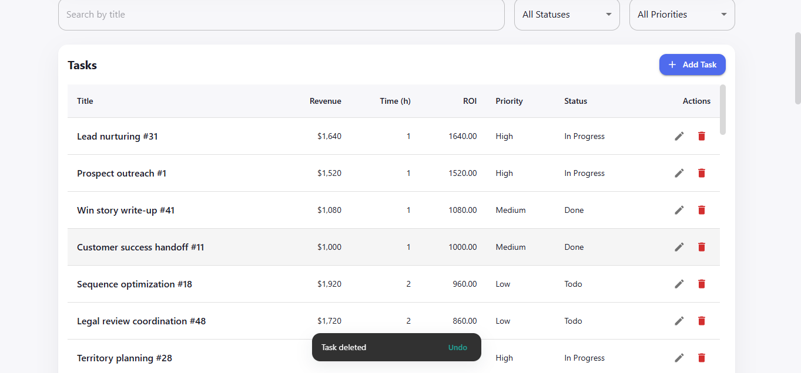
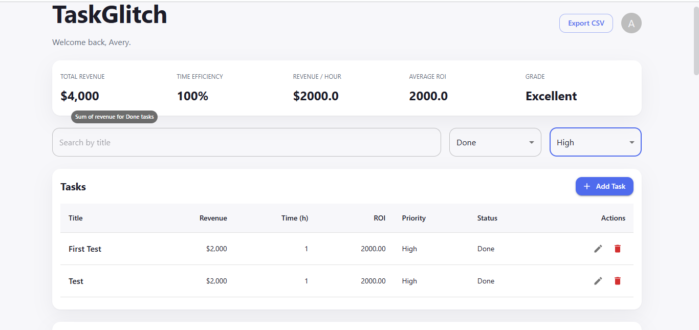

# 🧠 Task Glitch – Bug Fixes Challenge

Task Glitch is a Task Management Web Application built for sales teams to manage, track, and prioritize tasks based on ROI (Return on Investment).  
This repository contains bug fixes and stability improvements completed as part of the **SDE Bug Fixes Challenge**.

---

## 🚀 Live Application

🔗 Live URL:  
https://task-glitch.vercel.app

> Note: The application uses LocalStorage for data persistence. No backend is involved.

---

## 🛠️ Tech Stack

- React
- JavaScript (ES6+)
- React Hooks
- CSS
- LocalStorage
- Vercel (Deployment)

---

## ✅ Core Features

- Add, edit, and delete tasks
- View task details and notes
- Search and filter by status and priority
- ROI calculation (Revenue ÷ Time Taken)
- Sort tasks by ROI and priority
- Summary insights:
  - Total revenue
  - Efficiency
  - Average ROI
  - Performance grade
- Import and export tasks via CSV
- Undo delete using snackbar
- Persistent storage using LocalStorage

---

## 🐞 Bugs Fixed

### 🐛 Bug 1: Double Fetch on Page Load
**Problem:**  
Task data was being loaded twice on initial page load.

**Fix Applied:**  
- Corrected `useEffect` logic to prevent duplicate initialization.
- Ensured data fetch runs only once.

**Result:**  
Tasks load exactly once with no duplication.

---

### 🐛 Bug 2: Undo Snackbar Restoring Old Tasks
**Problem:**  
Closing the snackbar did not reset the deleted task state, causing incorrect task restoration.

**Fix Applied:**  
- Reset `lastDeletedTask` and related flags when snackbar closes.
- Undo works only during the active snackbar window.

**Result:**  
No phantom or incorrect task restoration.

---

### 🐛 Bug 3: Unstable Sorting When ROI Matches
**Problem:**  
Tasks with the same ROI and priority reordered randomly on re-renders.

**Fix Applied:**  
- Added a deterministic tie-breaker using task title.

**Result:**  
Sorting is stable and consistent across reloads and renders.

---

### 🐛 Bug 4: Multiple Dialogs Opening
**Problem:**  
Clicking Edit or Delete opened both the View dialog and the respective action dialog.

**Fix Applied:**  
- Prevented event bubbling.
- Separated click handlers for row and action buttons.

**Result:**  
Only the intended dialog opens for each action.

---

### 🐛 Bug 5: ROI Calculation Errors
**Problem:**  
ROI showed `NaN`, `Infinity`, or incorrect values due to invalid inputs or division by zero.

**Fix Applied:**  
- Added validation for revenue and time inputs.
- Handled `time = 0` safely.
- Formatted ROI values to two decimal places.

**Result:**  
ROI calculations are accurate and UI-safe.

---
### Insights Dashboard – Revenue Capping for Better Visibility

In the Insights dashboard, revenue values are capped at **100,000** for chart visualization.

This was done to handle edge cases where a task may have extremely large revenue values (e.g. `9999999999999`).  
Without capping, a single task would dominate the chart and make other values unreadable.

- The cap is applied **only for charts**
- Actual revenue values remain unchanged in:
  - Task table
  - Metrics calculations
  - CSV export
- This ensures charts stay readable and visually balanced

The screenshot below demonstrates capped revenue values while preserving accurate underlying data.


---

## 📸 Screenshots

### Dashboard


### Add / Edit Task


### Delete with Undo Snackbar


### Stable Sorting with Same ROI


---


## ▶️ Run Locally

```bash
git clone https://github.com/BandiKantiChaitanya/taskglitch.git
cd task-glitch
npm install
npm start
